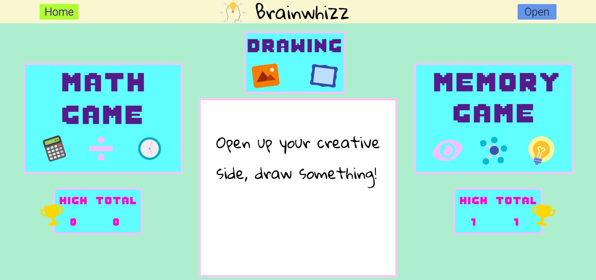

# Brainwhizz

Brainwhizz is an application geared towards children ages 6 to 10 that endeavours to improve such cognitive skills as their thinking and memory as well as allowing them to express themselves creatively.  

A live version can be found [here](https://brainwhizz.herokuapp.com/). 

## Features 

1. *Users*: Signup, log in, log out. Authenticated users will be able to play games, draw and check their scores on their own personal page (as seen in the image above). 
2. *Math Game*: User tries to answer as many math problems as they can in a one minute time limit. Math problems are randomly generated, simple problems involving two integers and a math operator. The user receives a game score at the end of the minute. 
3. *Memory Game*: User is given an automatically generated color transition sequence that they must remember and then return back by clicking the correct colors. Each success brings on another round, with an additional color added to the transition sequence. 
4. *Drawing*: User is provided with a blank canvas with which they can draw whatever their heart desires, utilizing different colors and stroke sizes. The drawing can be reset to a previous save point if the user dislikes the recent drawing additions.  
5. *Scores*: Each game played in either Math or Memory will generate a higher total score for the User, and also give them the opportunity to set or beat a previous high score.   

## Technologies Used

A list of the main technologies in use within this project. 

### Backend
* PostgreSQL
* Flask
    * with SQLAlchemy 
    * with WTForms

### Frontend
* React
* Redux

## Upcoming Features 
* Game difficulty settings 
* Additional spelling game 
* User follow for score comparisons between users 

## Contributing 
* **Rhys Previte** - [GitHub](https://github.com/Preezey24)
