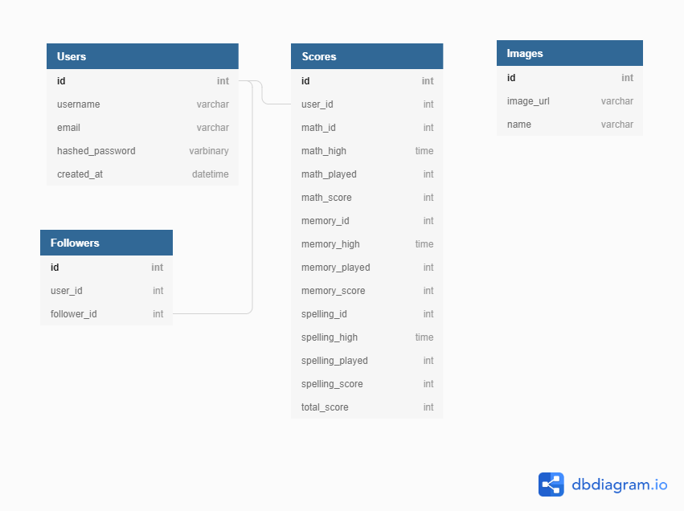

## MVP feature list
### 1. Application to be hosted on Heroku 
### 2. Users 
  * Sign up, sign in, log out
  * Only logged in users can access the mini-games and have their scores recorded and compared to other users 
### 3. Mini-game 1 
  * Users will be able to try and solve as many math problems as possible in an assigned time limit 
  * Math problems will be of multiplication, division, subtraction and addition 
  * Users will get a score at the end of the game that will be added to the user's accumulated point score
### 4. Mini-game 2 
  * Users will be required to follow the steps of a particular pattern, testing their memory. As they advance, the number of steps increases
  * Users will get a score at the end of the game that will be added to the user's accumulated point score
### 5. Mini-game 3 
  * Users will be asked to spell a word correctly based on an image that appears on their screen within an assigned time limit 
  * Users will get a score at the end of the game that will be added to the user's accumulated point score
### 6. Profile 
  * Users will be able to view their profile, where amongst other things will be their total point score and high score for each mini-game 

## Bonus feature list 
### 1. Customizable user image 
  * Users will be able to create a simple image of themselves if they wish using a paint feature. They also will have the option to load an image of themselves from their computer 
### 2. Followers 
  * Users will be able to follow other users and compare high scores, total scores if they wish (optional feature to keep your scores private)
### 3. Map search feature 
  * Users will be able to utilize their geolocation on an interactive map where they can find other users in their area, choose to follow and compare scores 

## Database schema 

- **Note:** Followers table is a join table. As such, there are no associations to itself, but rather associations for the Users table 

## Technologies used 
* React-redux 
* Python
* Javascript 
* SQLAlchemy 
* Postgres

## Routes 
### /
  * GET: displays splash page, either in authorized or unauthorized view depending
### users/user_id
  * GET: displays profile page of user that includes information on their scores (bonus features such as description & image)
### auth/login 
  * POST: logs user in
### auth/logout 
  * GET: logs user out 
### auth/signup
  * POST: creates a new user and logs them in
### auth/unauthorized 
  * GET: returns unauthorized when login auth fails 
### games/game_id/users/user_id 
  * GET: returns information on user high score, number of times played, and total points scored for this game 
  * POST: creates a new user to the scores table if they have not yet completed one game 
  * PUT: edits the number of times played, total points scored for this game and possibly edits the high score after each game 
        completed 

## Components list 
## Splash page (unauthorized)
  * Login, sign up buttons that produce modals when clicked with login or sign up form
  * Half the page with an image of someone playing a mini game 
  * Other half of page with something additional and fun/knowledge related 
## Splash page (authorized)
  * Navigation bar with logout, profile 
  * Body of the page with 3 containers that have links to each of the 3 games 
  * Footer that has information regarding GitHub link, LinkedIn link
## Game pages general 
  * All 3 games will have a section that shows their scores related with that game 
## Game page math 
  * A container with 10 math problems rendered, with input boxes for each problem where you type your answer 
  * Once you complete 10 questions, granted more time on the screen, press button or enter to transition to new set of 10 questions
  * Clock that has an associated timer, counting down from a set time 
  * Modal that pops out at time limit end with score update 
## Game page memory 
  * A container that has 5 lights, that flash one at a time, with an additional flash on the next round
  * Modal that pops out once the game ends with score update 
## Game page spelling 
  * A picture loads from the database (redux store) with an associated input field to type your answer 
  * Modal that pops out once the game ends with score update 